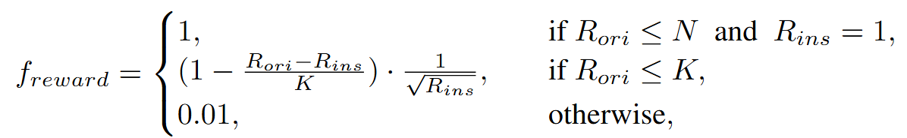

<h1 align="center"><b>InfoSearch--Beyond Content Relevance: Evaluating Instruction Following in Retrieval Models</b></h1>

<h4 align="center">
    <p>
        <a href="#links">Model/Data Links</a> |
        <a href="#installation">Installation</a> |
        <a href="#usage">Usage</a> |
        <a href="#citing">Citing</a> |
    </p>
</h4>

Official repository for the
paper [Beyond Content Relevance: Evaluating Instruction Following in Retrieval Models](https://arxiv.org/abs/2410.23841).

## Abstract

Instruction-following capabilities in large language models (LLMs) have significantly progressed, enabling more complex
user interactions through detailed prompts. However, retrieval systems have not matched these advances, most of them
still relies on traditional lexical and semantic matching techniques that fail to fully capture user intent. Recent
efforts have introduced instruction-aware retrieval models, but these primarily focus on intrinsic content relevance,
which neglects the importance of customized preferences for broader document-level attributes. This study evaluates the
instruction-following capabilities of various retrieval models beyond content relevance, including LLM-based dense
retrieval and reranking models. We develop **InfoSearch**, a novel retrieval evaluation benchmark spanning
six document-level attributes: **Audience**, **Keyword**, **Format**, **Language**, **Length**, and
**Source**, and introduce novel metrics -- Strict Instruction Compliance Ratio (SICR) and Weighted Instruction
Sensitivity Evaluation (WISE) to accurately assess the models' responsiveness to instructions. Our findings reveal that
while reranking models generally surpass retrieval models in instruction following, they still face challenges in
handling certain attributes. Moreover, although instruction fine-tuning and increased model size lead to better
performance, most models fall short of achieving comprehensive instruction compliance as assessed by our benchmark.

## Overview

### Dataset Construction

We construct a dataset that contains 6 dimensions by consciously integrating conditions when filtering Q-A pairs from
existing datasets or web pages.


### Retrieval Modes


In order to better detect the instruction-following capabilities of retrieval models, we introduce three retrieval
modes.

- **Original Mode**: This mode serves as a baseline that evaluates the model’s basic retrieval ability to find pertinent
  information without any specific constraints.
- **Instructed Mode**: In this mode, the model is required to find documents that are content relevant and satisfy the
  condition specified in the instruction.
- **Reversely Mode**: In this mode, the model is required to find documents that are content relevant and do \emph{not}
  satisfy the condition specified in the instruction, which tests the model's ability to understand negation.

### Evaluation Metrics

We define two novel metrics to quantify the model's responsiveness to instructions: Strict Instruction Compliance Ratio(
**SICR**) and Weighted Instruction Sensitivity Evaluation(**WISE**).

- **SICR:**

<p align="center">
  
</p>

- **WISE:**

<p align="center">
  
  
  
</p>
<p align="center">
  
</p>

### Results

Radar plots comparing the WISE scores of various models across different dimensions (the left is retrieval models, and
the right is reranking models),
highlighting the strengths and weaknesses of each model in handling different types of instructions.
Among retrieval models, GritLM demonstrates the strongest instruction-following capability, while GPT-4 consistently
performs the best across all dimensions in the reranking category.
<p align="center">
  
  
</p>

Performance comparison of different retrieval models averaged over six dimensions.


## Links

- The evaluation code leverages the scripts provided by the [FollowIR](https://github.com/orionw/FollowIR) framework,
  which offer robust tools for assessing instruction-following capabilities.

### Test Datasets

| Dimension                                                           | Description                                                                    |
|:--------------------------------------------------------------------|:-------------------------------------------------------------------------------|
| [Language-v1](https://huggingface.co/datasets/jianqunZ/Language-v1) | Including the conditions [Chinese], [English]                                  |
| [Clarity-v1](https://huggingface.co/datasets/jianqunZ/Clarity-v1)   | Including the condition [keyword] which need to be exactly matched in document |
| [Audience-v1](https://huggingface.co/datasets/jianqunZ/Audience-v1) | Including the conditions [layman], [expert]                                    |
| [Length-v1](https://huggingface.co/datasets/jianqunZ/Length-v1)     | Including the conditions [sentence], [paragraph], [article]                    |
| [Source-v1](https://huggingface.co/datasets/jianqunZ/Source-v1)     | Including the conditions [blog], [forum post], [news]                          |
| [Format-v1](https://huggingface.co/datasets/jianqunZ/Format-v1)     | Including the conditions [post], [code], [manual]                              |

### Train Dataset

| Dataset                                         | Description                                   |
|:------------------------------------------------|:----------------------------------------------|
| [InfoSearch-train](train/InfoSearch_train.json) | We design a train dataset to fine-tune models |

## Installation

If you wish to reproduce the experiments in the paper you can use the following code:

```bash
git clone https://github.com/EIT-NLP/InfoSearch.git
cd InfoSearch/evaluation/
conda create -n infosearch python=3.9 -y
conda activate infosearch
pip install -r requirements.txt
```

We modified the `mteb` library to calculate the **WISE** and **SICR** metrics. You can install the modified version of
the library by running the following command:

```bash
cd mteb_infosearch
pip install mteb_infosearch-0.1.0-py3-none-any.whl --no-deps
```

## Usage

Our task names include:

- Language-v1
- Clarity-v1
- Audience-v1
- Length-v1
- Source-v1
- Format-v1

Here is an example of how to evaluate a model on a specified task:

```bash
cd evaluation/

CUDA_VISIBLE_DEVICES=0 python models/e5/evaluate_e5.py \
--model_name_or_path infloat/e5-large-v2 \
--output_dir e5-large_result \
--batch_size 32 \
--pool_type avg \
--task_names Language-v1
```

You can also evaluate on multiple tasks by adding more task names to the `--task_names` argument. Each task should be
separated by a comma.

```bash
--task_names Language-v1, Clarity-v1, Audience-v1
```

### Point-wise Rerank Usage

If you want to evaluate with your own reranker model, you need to add your model to MODEL_DICT in `reranker_models.py`
and then run the following command:

```bash
CUDA_VISIBLE_DEVICES=0 python models/rerankers/evaluate_reranker.py \
--model_name_or_path /path/to/your/model \
--output_dir /path/to/output/dir \
--batch_size 16 \
--task_names Language-v1
```

It will take a while to evaluate a model on each task.

### List-wise Rerank Usage
[RankLLM](https://github.com/castorini/rank_llm) provides useful tools for list-wise reranking.

```bash
git clone https://github.com/castorini/rank_llm.git
cd rank_llm
conda create -n rankllm python=3.10 -y
conda activate rankllm
pip install -r requirements.txt
```

We provide a script to rerank retrieval results and retrieval results based on `e5-mistral` under the `listwise` directory. 
If you want to rerank retrieval results, you need to put the retrieval results in the `rank_llm/src/rankllm/dimension` directory and 
put the `rerank.py` script in the `rank_llm/src/rankllm` directory.

```plaintext
rank_llm/
├── src/
│   ├── rankllm/
│   │   ├── ...
│   │   ├── dimension
│   │   │   ├── Audience-v1_ch_retrieval_results.json
│   │   │   ├── ...
│   │   ├── ...
│   │   ├── rerank.py
│   │   ├── ...
├── ...
```

If you want to rerank your own retrieval results, please make sure the retrieval results are in the following format:
```json
[
  {
    "query": {
      "text": "Do Walnuts Really Improve Artery Function?",
      "qid": "0"
    },
    "candidates": [
      {
        "docid": "0",
        "score": 1.0,
        "doc": {
          "content": "Walnuts, like other nuts, have been found to have potential benefits for..."
        }
      },
      {
        "docid": "1",
        "score": 0.5,
        "doc": {
          "content": "The consumption of nuts, such as almonds and pistachios, has been linked to numerous health benefits..."
        }
      },
      ...
    ]
  },
  ...
]
```

Example usage of the list-wise reranker:
```bash
# Make sure the current directory is rank_llm/src
CUDA_VISIBLE_DEVICES=0 python -m rank_llm.rerank.py \
--model_path /path/to/your/model \
--dataset Language-v1 \
--context_size 4096 \
--top_k_candidates 100
```

## Citing

If you found the code, data or model useful, free to cite:

```bibtex
@misc{zhou2024contentrelevanceevaluatinginstruction,
      title={Beyond Content Relevance: Evaluating Instruction Following in Retrieval Models}, 
      author={Jianqun Zhou and Yuanlei Zheng and Wei Chen and Qianqian Zheng and Zeyuan Shang and Wei Zhang and Rui Meng and Xiaoyu Shen},
      year={2024},
      eprint={2410.23841},
      archivePrefix={arXiv},
      primaryClass={cs.IR},
      url={https://arxiv.org/abs/2410.23841}, 
}
```

